# Oversikt over norsk sokkel etter funntiår

## Olje
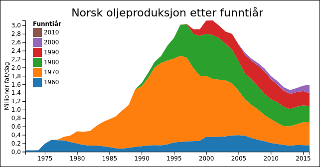

Oljeproduksjonen per oktober 2016 er på 1,60 millionar fat/dag, som er 51,1% av nivået i januar 2001 (3,13 millionar fat/dag).
Dette gjev ein årleg produksjon på 0,6 milliardar fat.

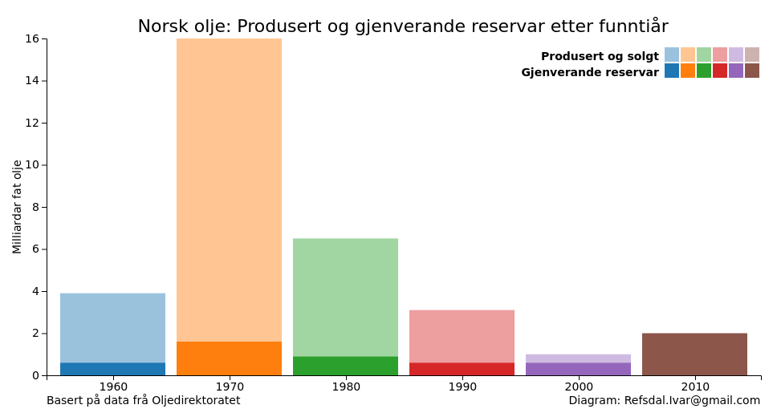

Dei opphavlege utvinnbare oljereservane er på 32,1 milliardar fat.
Totalt 80,1% av desse er utvunne.
Gjenverande reservar er på 6,4 milliardar fat.
Med noverande produksjonstempo er desse reservane utvunne på 10,9 år.

## Gass
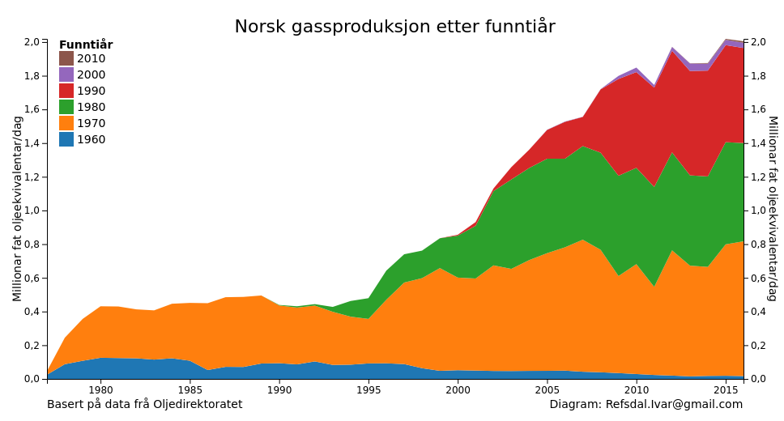

Gassproduksjonen per oktober 2016 er på 2,01 millionar fat oljeekvivalentar/dag, som er 95,6% av nivået i mai 2016 (2,10 millionar fat oljeekvivalentar/dag).
Dette gjev ein årleg produksjon på 0,7 milliardar fat.

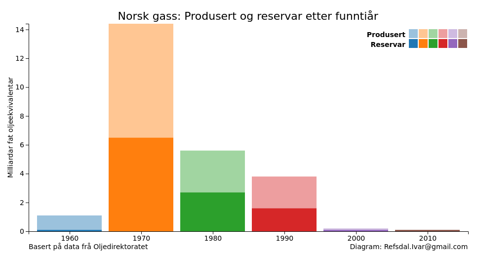

Dei opphavlege utvinnbare gassreservane er på 24,9 milliardar fat oljeekvivalent.
Totalt 53,0% av desse er utvunne.
Gjenverande reservar er på 11,7 milliardar fat oljeekvivalent.
Med noverande produksjonstempo er desse reservane utvunne på 15,9 år.

## Petroleum
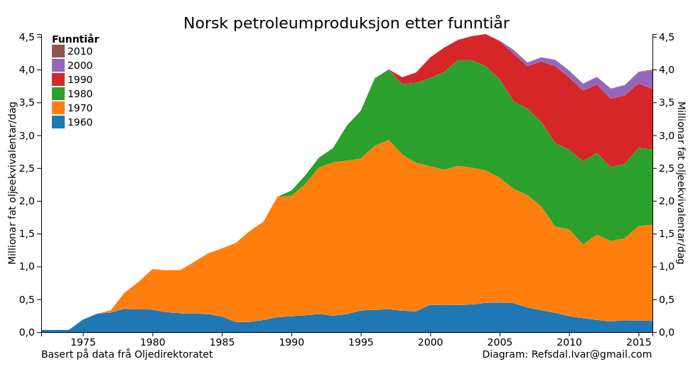

Petroleumproduksjonen per oktober 2016 er på 3,99 millionar fat oljeekvivalentar/dag, som er 86,3% av nivået i juli 2004 (4,62 millionar fat oljeekvivalentar/dag).
Dette gjev ein årleg produksjon på 1,5 milliardar fat.

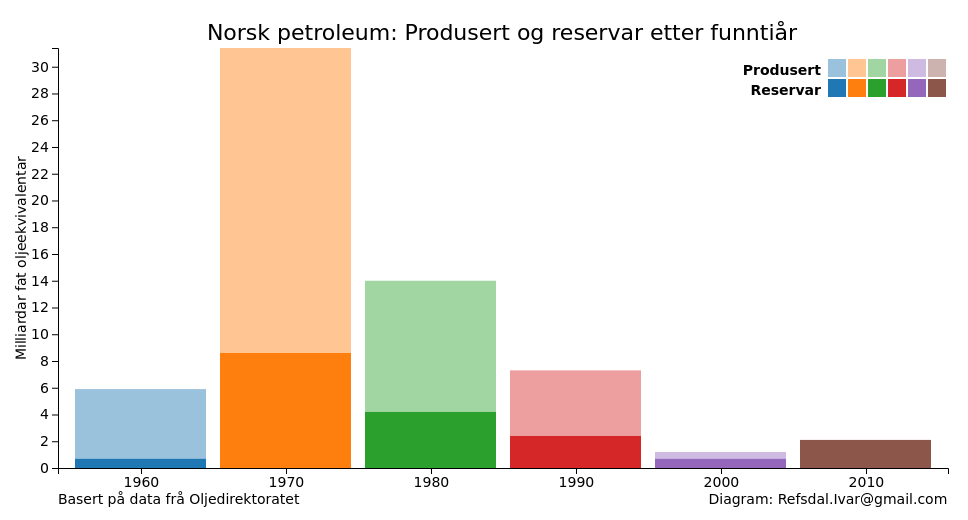

Dei opphavlege utvinnbare petroleumreservane er på 61,4 milliardar fat oljeekvivalent.
Totalt 67,9% av desse er utvunne.
Gjenverande reservar er på 19,7 milliardar fat oljeekvivalent.
Med noverande produksjonstempo er desse reservane utvunne på 13,5 år.

## Prosent av nåværende produksjon

Tabellen under angir prosentvis bidrag til petroleumsproduksjon på norsk sokkel. 
Disse er gruppert på funntiår.
Man kan med andre ord se at funn gjort på 1970-tallet noenlunde dominerer produksjonen. 

| Funntiår | Olje | Gass | Petroleum |
| ---- | ---: | ---: | ---: |
| 1960 | 9,6 | 0,8 | 4,3 |
| 1970 | 34,4 | 39,5 | 36,6 |
| 1980 | 23,8 | 29,3 | 28,9 |
| 1990 | 18,8 | 28,4 | 23,4 |
| 2000 | 13,4 | 1,5 | 6,5 |
| 2010 | 0,0 | 0,5 | 0,3 |

# Oversikt over norsk sokkel etter produksjonsstartår

## Olje
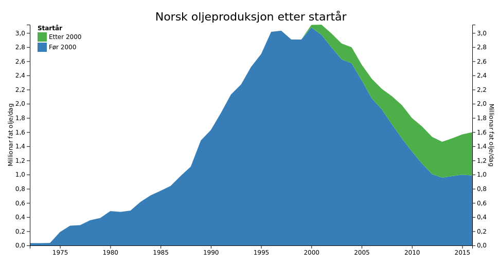
Felt med produksjonsstart før år 2000 står for 62% av dagens oljeproduksjon.

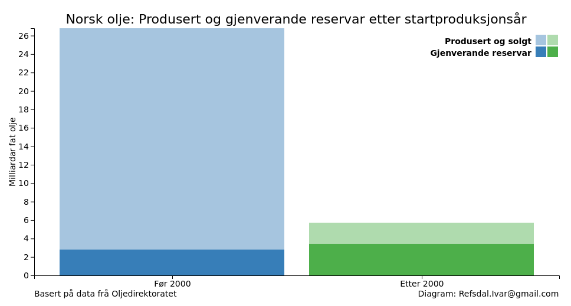

Reservane for felt med produksjonsstart før år 2000 er på 3,0 milliardar fat olje, og
totalt har desse felta produsert 23,6 milliardar fat olje.

Reservane for felt med produksjonsstart etter år 2000 er på 3,4 milliardar fat olje.
Johan Sverdrup (med planlagt produksjonsstart i 2019) har 52% av desse (1,8 milliardar fat olje).

## Gass
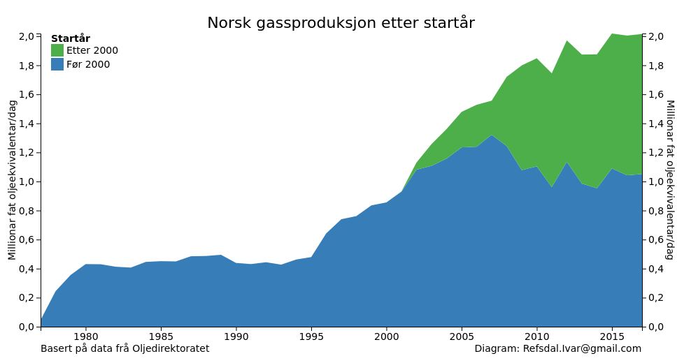
Felt med produksjonsstart før år 2000 står for 52% av dagens gassproduksjon.

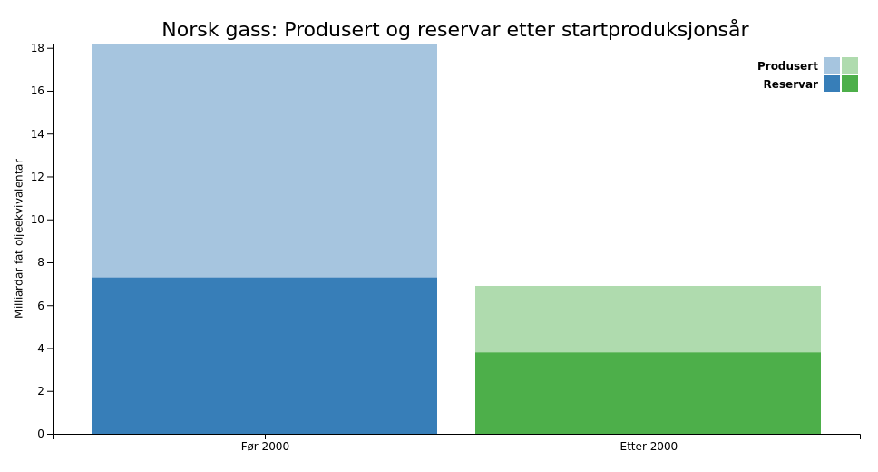

Reservane for felt med produksjonsstart før år 2000 er på 7,6 milliardar fat oljeekvivalentar, og
totalt har desse felta produsert 10,5 milliardar fat oljeekvivalentar.

Reservane for felt med produksjonsstart etter år 2000 er på 4,1 milliardar fat oljeekvivalentar.
Johan Sverdrup (med planlagt produksjonsstart i 2019) har 1% av desse (0,1 milliardar fat oljeekvivalentar).

## Petroleum
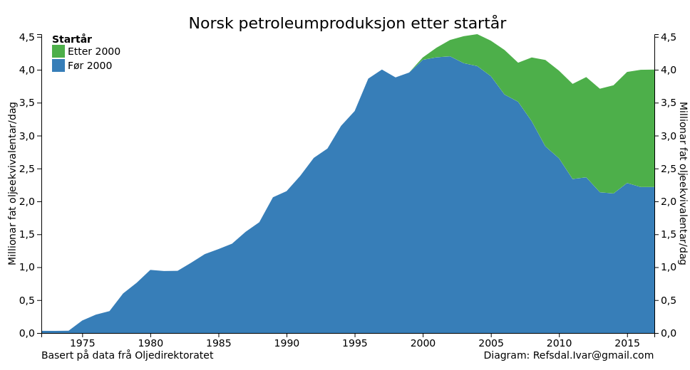
Felt med produksjonsstart før år 2000 står for 56% av dagens petroleumproduksjon.

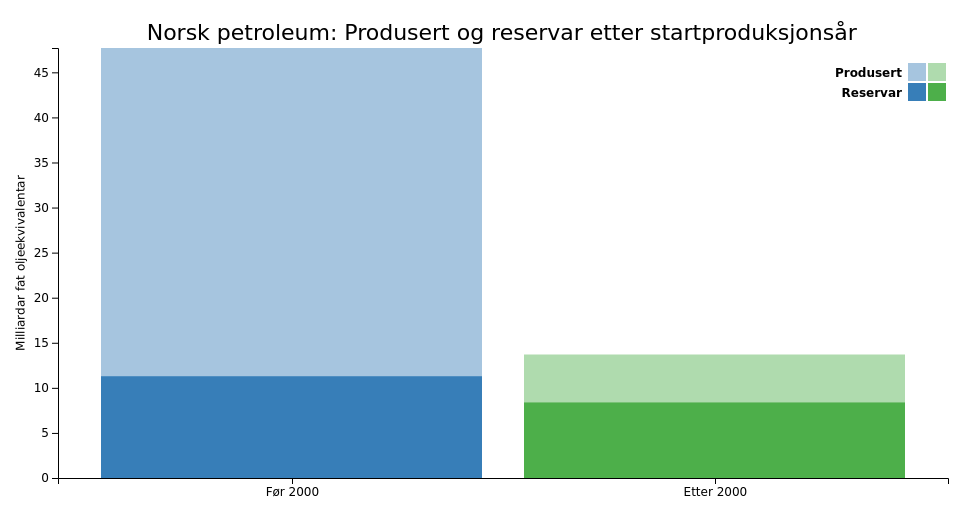

Reservane for felt med produksjonsstart før år 2000 er på 11,3 milliardar fat oljeekvivalentar, og
totalt har desse felta produsert 36,4 milliardar fat oljeekvivalentar.

Reservane for felt med produksjonsstart etter år 2000 er på 8,4 milliardar fat oljeekvivalentar.
Johan Sverdrup (med planlagt produksjonsstart i 2019) har 22% av desse (1,9 milliardar fat oljeekvivalentar).

# Oversikt over norsk sokkel etter region

## Olje

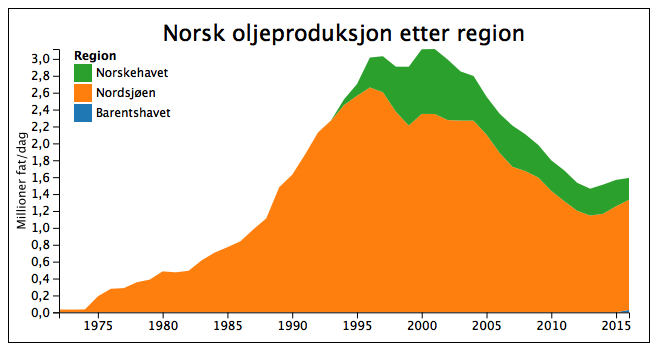
Nordsjøen står for 82% av oljeproduksjonen,
Norskehavet 16% og
Barentshavet 2%.

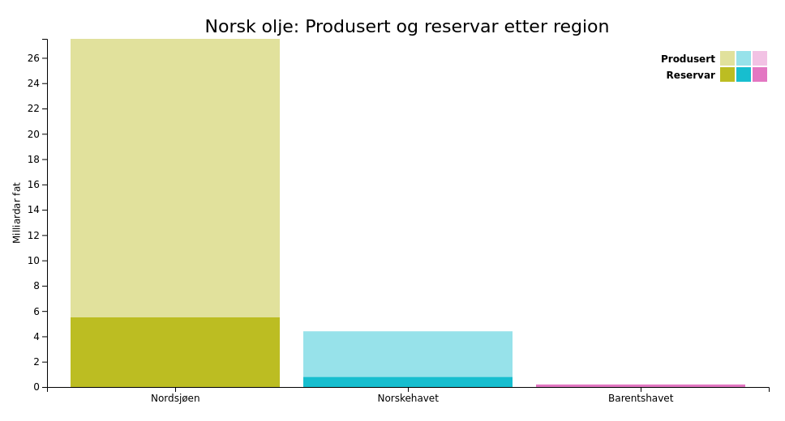
Nordsjøen har 86% (5,5 milliardar fat olje) av oljereservane.

Norskehavet har 12% (0,8 milliardar fat olje) av oljereservane.

Barentshavet har 3% (0,2 milliardar fat olje) av oljereservane.

## Gass

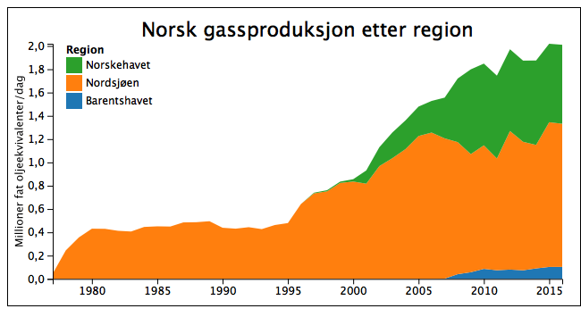
Nordsjøen står for 61% av gassproduksjonen,
Norskehavet 34% og
Barentshavet 5%.

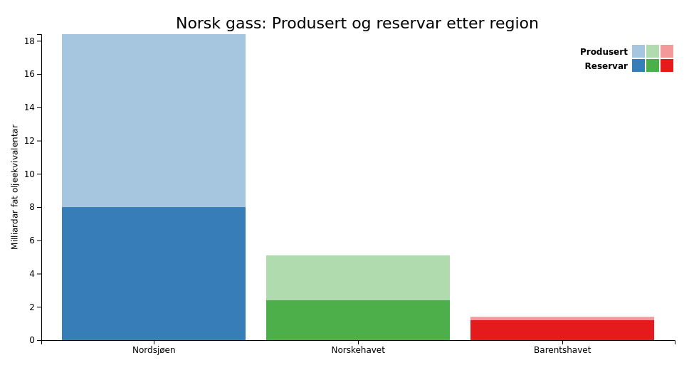
Nordsjøen har 68% (8,0 milliardar fat oljeekvivalentar) av gassreservane.

Norskehavet har 21% (2,4 milliardar fat oljeekvivalentar) av gassreservane.

Barentshavet har 10% (1,2 milliardar fat oljeekvivalentar) av gassreservane.

## Petroleum

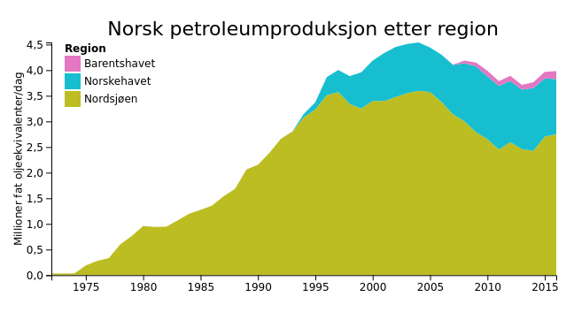
Nordsjøen står for 69% av petroleumproduksjonen,
Norskehavet 27% og
Barentshavet 4%.

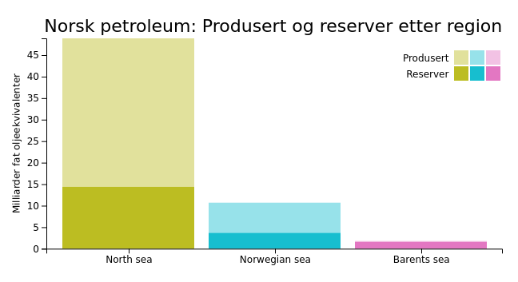
Nordsjøen har 73% (14,4 milliardar fat oljeekvivalentar) av petroleumreservane.

Norskehavet har 19% (3,7 milliardar fat oljeekvivalentar) av petroleumreservane.

Barentshavet har 8% (1,6 milliardar fat oljeekvivalentar) av petroleumreservane.

