# Oversikt over norsk sokkel etter funntiår

## Olje

Oljeproduksjonen per desember 2016 er på 1,62 millionar fat/dag, som er 51,6% av nivået i januar 2001 (3,13 millionar fat/dag).
Dette gjev ein årleg produksjon på 0,6 milliardar fat.

Dei opphavlege utvinnbare oljereservane er på 32,3 milliardar fat.
Totalt 81,1% av desse er utvunne.
Gjenverande reservar er på 6,1 milliardar fat.
Med noverande produksjonstempo er desse reservane utvunne på 10,3 år.

## Gass
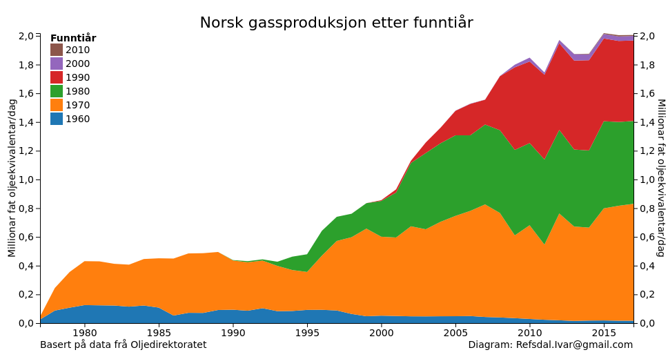

Gassproduksjonen per desember 2016 er på 2,00 millionar fat oljeekvivalentar/dag, som er 95,4% av nivået i mai 2016 (2,10 millionar fat oljeekvivalentar/dag).
Dette gjev ein årleg produksjon på 0,7 milliardar fat.

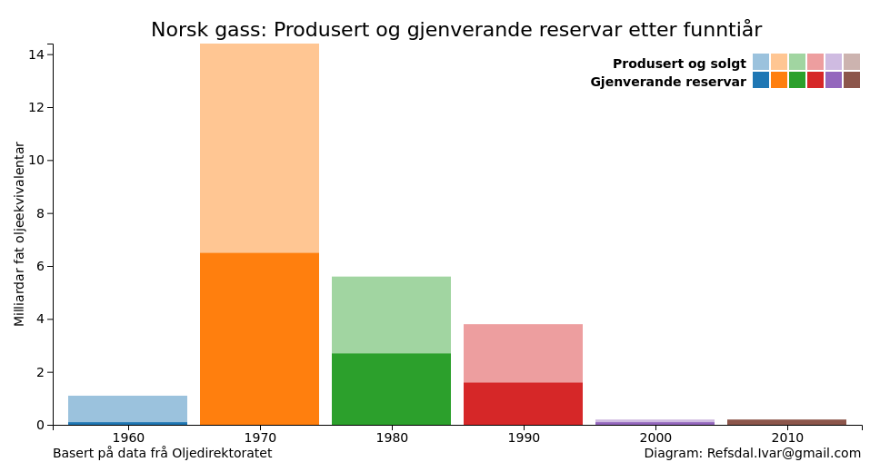

Dei opphavlege utvinnbare gassreservane er på 25,0 milliardar fat oljeekvivalent.
Totalt 55,6% av desse er utvunne.
Gjenverande reservar er på 11,1 milliardar fat oljeekvivalent.
Med noverande produksjonstempo er desse reservane utvunne på 15,1 år.

## Petroleum
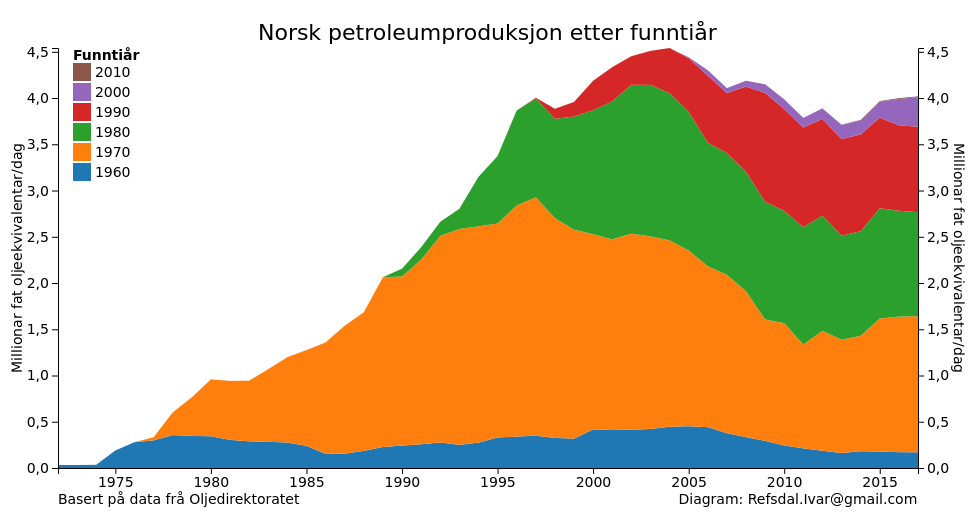

Petroleumproduksjonen per desember 2016 er på 4,00 millionar fat oljeekvivalentar/dag, som er 86,5% av nivået i juli 2004 (4,62 millionar fat oljeekvivalentar/dag).
Dette gjev ein årleg produksjon på 1,5 milliardar fat.

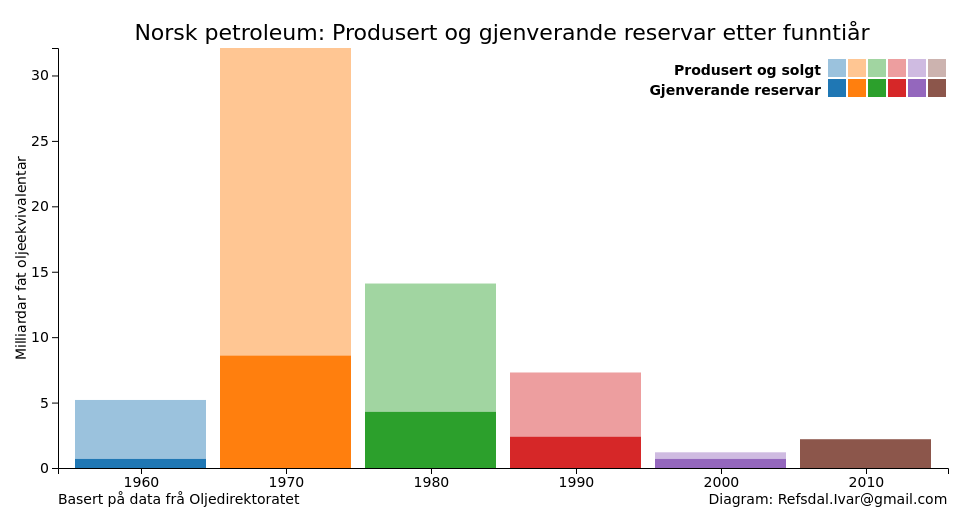

Dei opphavlege utvinnbare petroleumreservane er på 61,9 milliardar fat oljeekvivalent.
Totalt 69,8% av desse er utvunne.
Gjenverande reservar er på 18,7 milliardar fat oljeekvivalent.
Med noverande produksjonstempo er desse reservane utvunne på 12,8 år.

## Prosent av nåværende produksjon

Tabellen under angir prosentvis bidrag til petroleumsproduksjon på norsk sokkel. 
Disse er gruppert på funntiår.
Man kan med andre ord se at funn gjort på 1970-tallet noenlunde dominerer produksjonen. 

| Funntiår | Olje | Gass | Petroleum |
| ---- | ---: | ---: | ---: |
| 1960 | 9,4 | 0,8 | 4,3 |
| 1970 | 34,0 | 39,9 | 36,6 |
| 1980 | 23,3 | 29,1 | 28,6 |
| 1990 | 18,5 | 28,2 | 23,1 |
| 2000 | 14,7 | 1,5 | 7,1 |
| 2010 | 0,0 | 0,4 | 0,2 |

# Oversikt over norsk sokkel etter produksjonsstartår

## Olje
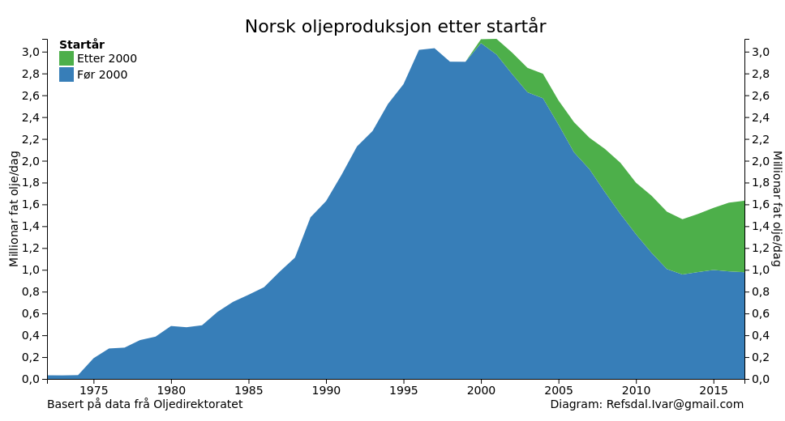
Felt med produksjonsstart før år 2000 står for 61% av dagens oljeproduksjon.

Reservane for felt med produksjonsstart før år 2000 er på 2,8 milliardar fat olje, og
totalt har desse felta produsert 24,0 milliardar fat olje.

Reservane for felt med produksjonsstart etter år 2000 er på 3,3 milliardar fat olje.
Johan Sverdrup (med planlagt produksjonsstart i 2019) har 54% av desse (1,8 milliardar fat olje).

## Gass

Felt med produksjonsstart før år 2000 står for 52% av dagens gassproduksjon.

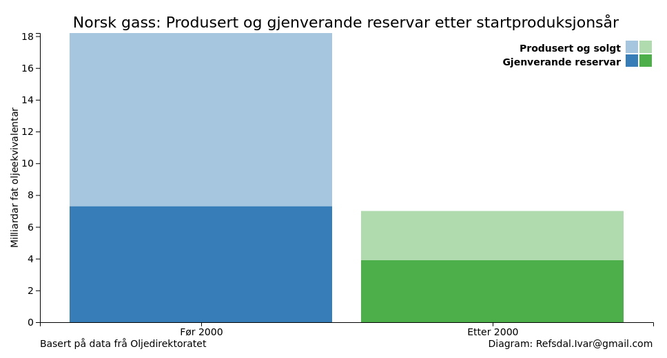

Reservane for felt med produksjonsstart før år 2000 er på 7,3 milliardar fat oljeekvivalentar, og
totalt har desse felta produsert 10,9 milliardar fat oljeekvivalentar.

Reservane for felt med produksjonsstart etter år 2000 er på 3,8 milliardar fat oljeekvivalentar.
Johan Sverdrup (med planlagt produksjonsstart i 2019) har 1% av desse (0,1 milliardar fat oljeekvivalentar).

## Petroleum

Felt med produksjonsstart før år 2000 står for 55% av dagens petroleumproduksjon.

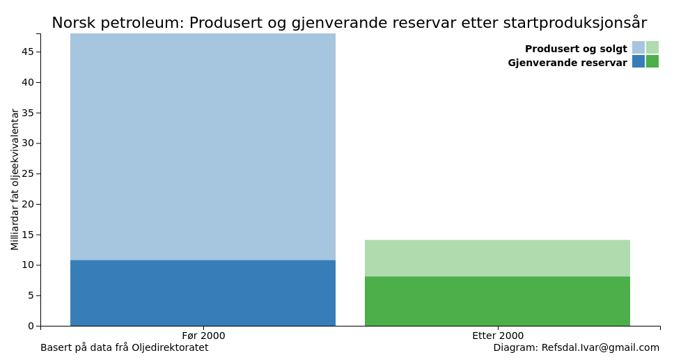

Reservane for felt med produksjonsstart før år 2000 er på 10,8 milliardar fat oljeekvivalentar, og
totalt har desse felta produsert 37,2 milliardar fat oljeekvivalentar.

Reservane for felt med produksjonsstart etter år 2000 er på 7,9 milliardar fat oljeekvivalentar.
Johan Sverdrup (med planlagt produksjonsstart i 2019) har 24% av desse (1,9 milliardar fat oljeekvivalentar).

# Oversikt over norsk sokkel etter region

## Olje

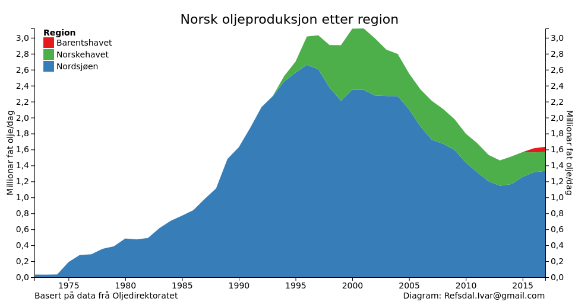
Nordsjøen står for 81% av oljeproduksjonen,
Norskehavet 15% og
Barentshavet 3%.

Nordsjøen har 85% (5,2 milliardar fat olje) av oljereservane.

Norskehavet har 11% (0,7 milliardar fat olje) av oljereservane.

Barentshavet har 3% (0,2 milliardar fat olje) av oljereservane.

## Gass

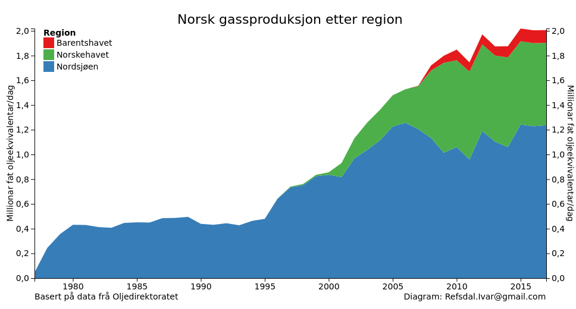
Nordsjøen står for 61% av gassproduksjonen,
Norskehavet 34% og
Barentshavet 5%.

Nordsjøen har 69% (7,7 milliardar fat oljeekvivalentar) av gassreservane.

Norskehavet har 21% (2,3 milliardar fat oljeekvivalentar) av gassreservane.

Barentshavet har 10% (1,1 milliardar fat oljeekvivalentar) av gassreservane.

## Petroleum

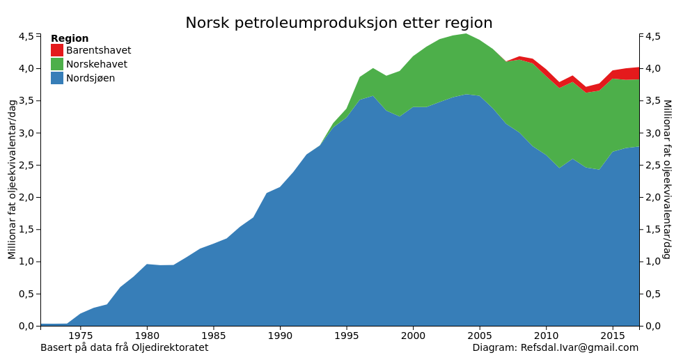
Nordsjøen står for 69% av petroleumproduksjonen,
Norskehavet 26% og
Barentshavet 4%.

Nordsjøen har 74% (13,8 milliardar fat oljeekvivalentar) av petroleumreservane.

Norskehavet har 18% (3,4 milliardar fat oljeekvivalentar) av petroleumreservane.

Barentshavet har 8% (1,5 milliardar fat oljeekvivalentar) av petroleumreservane.

# Oversikt over kumulativ produksjon vs nye felt sidan år 2000

Sidan årtusenskiftet har produksjonen på norsk sokkel vore fleire gonger større enn funna som er gjort.

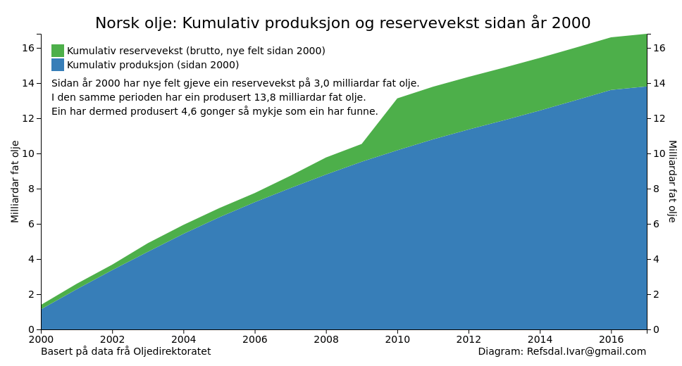

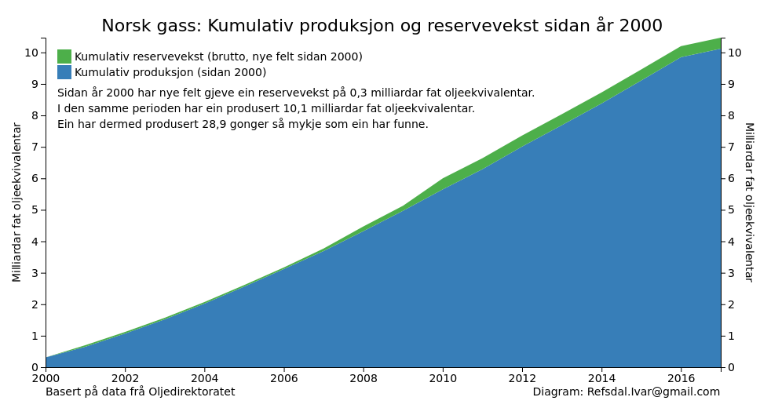

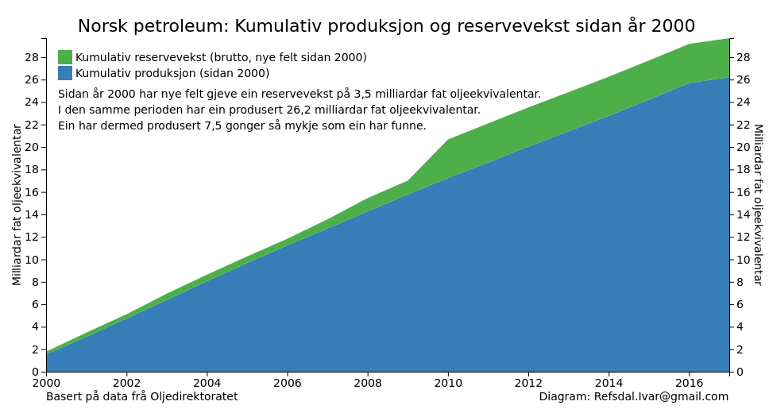

## Noter

Alle data som er brukt er henta frå [Oljedirektoratets faktasider](http://factpages.npd.no/factpages/).

Spørsmål, kontakt eller bruk? [refsdal.ivar@gmail.com](mailto:refsdal.ivar@gmail.com)
