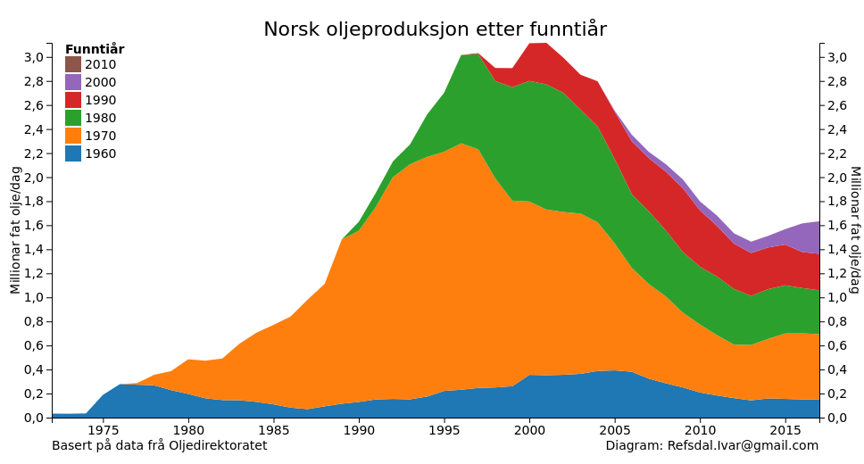
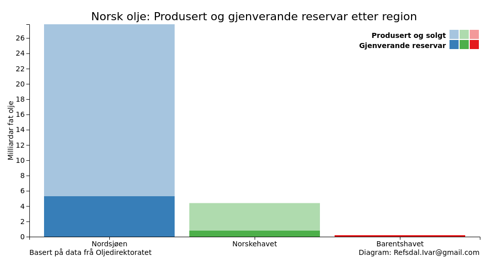
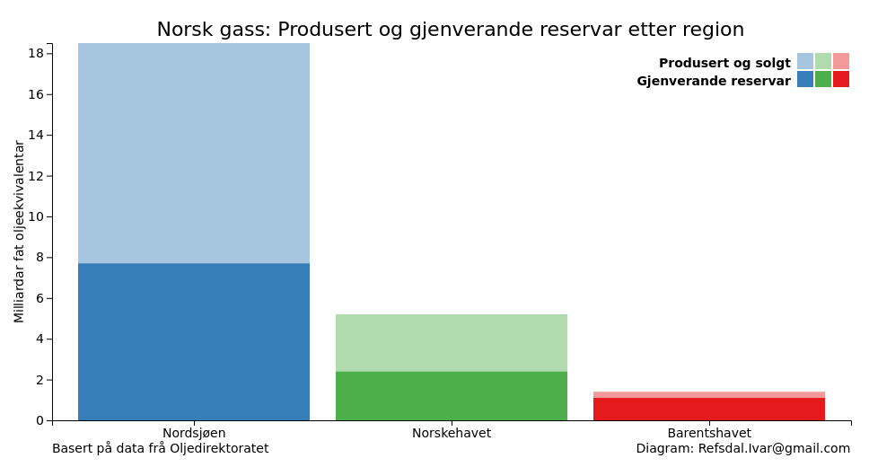
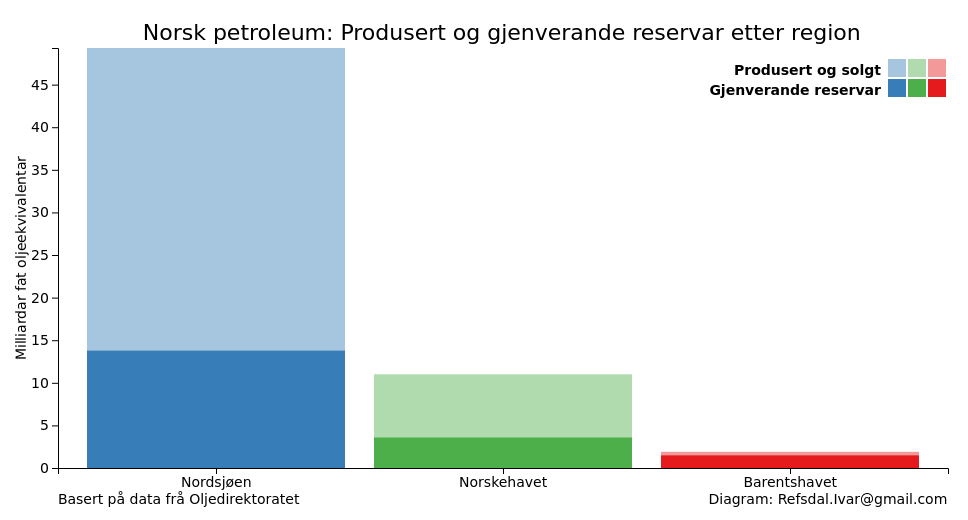

# Oversikt over norsk sokkel etter funntiår

## Olje

Oljeproduksjonen per september 2016 er på 1,59 millioner fat/dag, som er 50,8% av nivået i januar 2001 (3,13 millioner fat/dag).

Dei opprinnelig utvinnbare oljereservane er på 32,1 milliarder fat.
Totalt 80,1% av desse er henta ut.
Gjenverande reservar er på 6,4 milliarder fat.

## Gass

Gassproduksjonen per september 2016 er på 2,01 millioner fat oljeekvivalenter/dag, som er 95,6% av nivået i mai 2016 (2,10 millioner fat oljeekvivalenter/dag).

Dei opprinnelig utvinnbare gassreservane er på 24,9 milliarder fat oljeekvivalent.
Totalt 53,0% av desse er henta ut.
Gjenverande reservar er på 11,7 milliarder fat oljeekvivalent.

## Petroleum

Petroleumproduksjonen per september 2016 er på 3,98 millioner fat oljeekvivalenter/dag, som er 86,1% av nivået i juli 2004 (4,62 millioner fat oljeekvivalenter/dag).

Dei opprinnelig utvinnbare petroleumreservane er på 61,4 milliarder fat oljeekvivalent.
Totalt 67,9% av desse er henta ut.
Gjenverande reservar er på 19,7 milliarder fat oljeekvivalent.

## Prosent av nåværende produksjon

Tabellen under angir prosentvis bidrag til petroleumsproduksjon på norsk sokkel. 
Disse er gruppert på funntiår.
Man kan med andre ord se at funn gjort på 1970-tallet noenlunde dominerer produksjonen. 

| Funntiår | Olje | Gass | Petroleum |
| ---- | ---: | ---: | ---: |
| 1960 | 9,7 | 0,8 | 4,4 |
| 1970 | 34,7 | 39,5 | 36,7 |
| 1980 | 24,0 | 29,4 | 29,0 |
| 1990 | 18,9 | 28,3 | 23,4 |
| 2000 | 12,7 | 1,5 | 6,2 |
| 2010 | 0,0 | 0,5 | 0,2 |

# Oversikt over norsk sokkel etter region

## Olje

## Gass

## Petroleum

